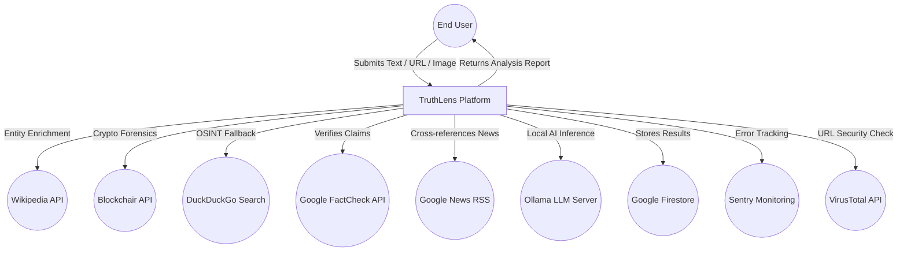
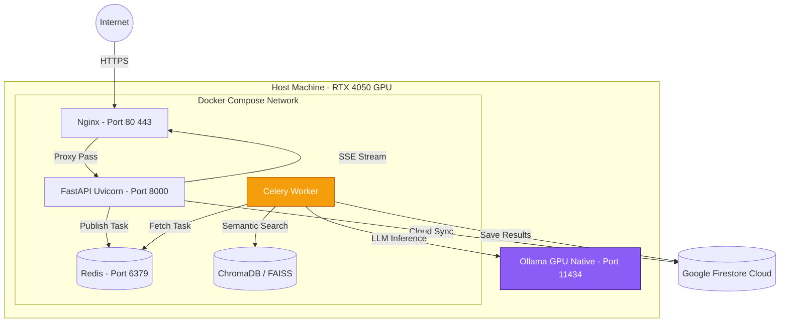
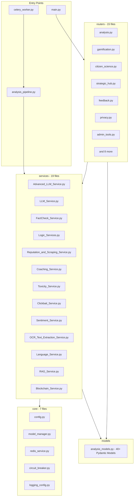
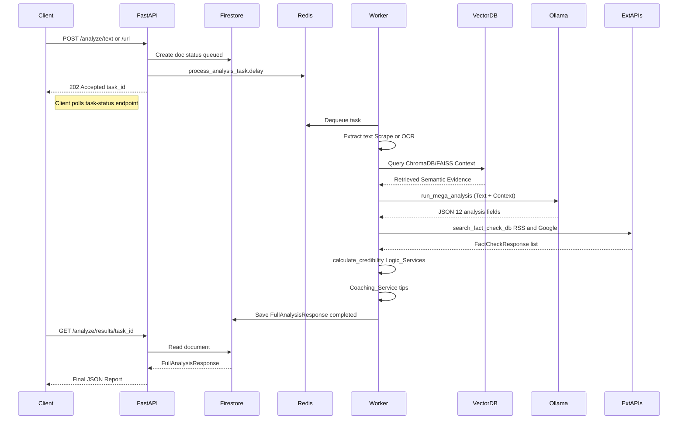
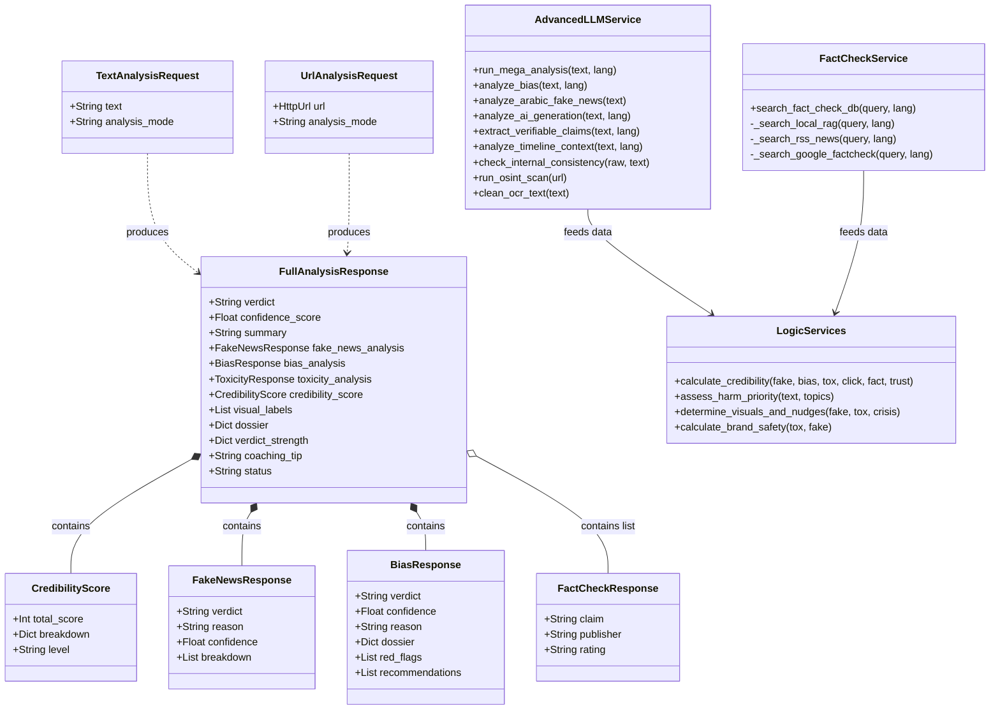
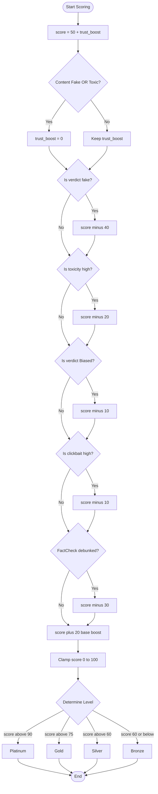
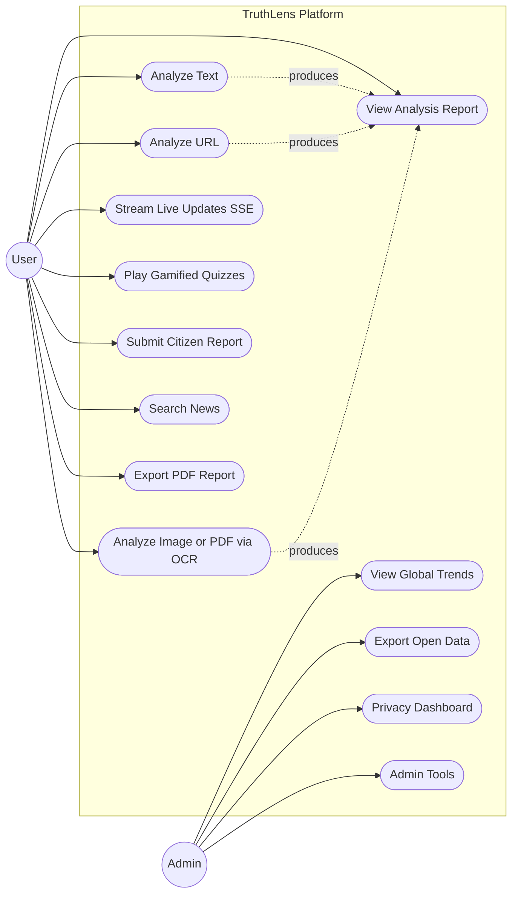
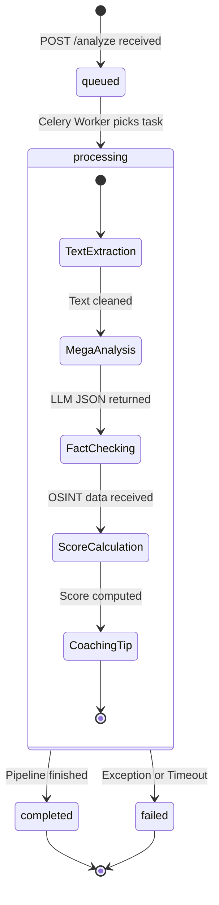
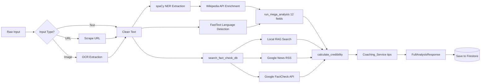
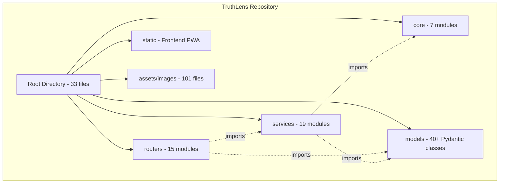

# TruthLens: An AI-Assisted Credibility Assessment Platform

[](https://www.gnu.org/licenses/gpl-3.0)
[](https://doi.org/10.5281/zenodo.19591334)
[](https://www.python.org/downloads/)
[](https://fastapi.tiangolo.com)
[](https://www.docker.com/)
[](https://github.com/features/actions)
[](https://www.linkedin.com/pulse/truthlens-ai-assisted-credibility-assessment-platform-majd-ayoub-psowf)
[](https://doi.org/10.5281/zenodo.19591334)


> ⭐ **If you find this project useful or interesting, please consider giving it a Star and Fork to support the research!** ⭐️

<!-- UI SCREENSHOT/BANNER PLACEHOLDER: Uncomment and add the path to your UI screenshot here -->

<!--  -->

## 📑 Table of Contents

- [Overview](#-overview)
- [Why TruthLens? (The Hybrid Approach)](#-why-truthlens-the-hybrid-approach)
- [Official Publication &amp; Citation](#-official-publication--citation)
- [Intellectual Property &amp; Copyright Notice](#%EF%B8%8F-intellectual-property--copyright-notice)
- [Key Technical Features](#-key-technical-features)
- [System Architecture (High-Level)](#-system-architecture-high-level)
- [Tech Stack](#-tech-stack)
- [Project Structure](#-project-structure)
- [Quick Start (The Simplest Way)](#-quick-start-the-simplest-way)
- [Analysis Modules](#%EF%B8%8F-analysis-modules)
- [Detailed System Architecture (UML Diagrams)](#-detailed-system-architecture-uml-diagrams)
- [Contact &amp; Professional Network](#-contact--professional-network)

---

## 🌟 Overview

TruthLens is a high-performance, decision-support system engineered to combat the spread of misinformation. Unlike traditional fact-checking tools, TruthLens leverages a Hybrid Intelligence Architecture that combines Local Large Language Models (LLMs), classical machine learning, and Open-Source Intelligence (OSINT) streams to provide real-time credibility scores.

## 💡 Why TruthLens? (The Hybrid Approach)

Standard LLMs often suffer from "hallucinations" and lack real-time context. TruthLens solves this by using a strictly constrained **Hybrid Pipeline**:

1. **Local LLMs (Qwen 3 / Phi-3)** handle only linguistic parsing (detecting bias, toxicity, and logical fallacies).
2. **OSINT integrations (Google FactCheck API, RSS Feeds, VirusTotal)** provide hard, verified external evidence.
   This ensures credibility scores are grounded in verifiable reality, not AI approximations.

## 📚 Official Publication & Citation

The comprehensive 100-page technical architecture and research report for TruthLens is officially published and archived on Zenodo.

* **Official DOI:** `10.5281/zenodo.19591334`
* **Permanent Link:** [https://doi.org/10.5281/zenodo.19591334](https://doi.org/10.5281/zenodo.19591334)

**Citation (APA):**

> Ayoub, M. M. (2026). TruthLens: An AI-Assisted Credibility Assessment Platform (Technical Report). Zenodo. https://doi.org/10.5281/zenodo.19591334

## ⚖️ Intellectual Property & Copyright Notice

**Copyright © 2026 Majd Majdi Ayoub. All Rights Reserved.**

* **Original Concept:** Majd Majdi Ayoub.
* **Technical Implementation:** 100% developed and architected by Majd Majdi Ayoub.
* **Documentation:** The technical report archived under DOI: 10.5281/zenodo.19591334 is the sole intellectual property of the author.
* **Note:** While this project was submitted as a formal graduation requirement for the Faculty of Engineering Technology at Al-Balqa Applied University, all technical assets (Code, Architecture, AI Orchestration) remain the author's intellectual property.

## 🚀 Key Technical Features

* **Hybrid AI Orchestration:** Seamless integration of Qwen 3 (8B) and Phi-3 Mini for local, privacy-conscious reasoning and semantic validation.
* **Bilingual NLP & Sentiment Engine:** Advanced processing of both Arabic (including dialects) and English using CAMeL-BERT, FastText, TextBlob, and **spaCy** for Named Entity Recognition (NER).
* **Asynchronous & Real-Time Processing:** Built for high concurrency using FastAPI with Celery and Redis for background task management, delivering live analysis updates via **Server-Sent Events (SSE)**.
* **Advanced RAG & Vector Search:** Proprietary Knowledge Base backed by **ChromaDB** and **FAISS** for rapid similarity search and evidence retrieval.
* **Comprehensive OSINT & Forensics:** Real-time data fetching using DuckDuckGo Search (DDGS), Google FactCheck, Wikipedia API, and domain reputation analysis (WHOIS/IPWhois).
* **Multimodal Data Ingestion:** Supports text, URL scraping (via Newspaper3k & BeautifulSoup), and deep extraction from Images and PDFs using **Tesseract OCR** and **PDFPlumber**.
* **Scalable Infrastructure:** Fully containerized environment using Docker Compose with built-in **Sentry** for crash tracking and performance monitoring.

## 🏗 System Architecture (High-Level)

The system is built on a 4-tier architectural model:

1. **Ingestion Layer:** Captures news articles and social media metadata.
2. **Analysis Layer:** Parallel processing through AI classifiers and LLMs.
3. **Validation Layer:** Cross-checking results with OSINT APIs.
4. **Presentation Layer:** A clean, data-driven dashboard for end-user insights.

## 🛠 Tech Stack

* **Language:** Python 3.10+
* **AI/ML Models:** Transformers (HuggingFace), Qwen-8B, Phi-3, CAMeL-BERT, Scikit-learn, Skops, **spaCy**, **Detoxify** (Hate Speech).
* **Backend & Streaming:** FastAPI, Uvicorn, SSE-Starlette.
* **Task Queue & Cache:** Celery, Redis.
* **Vector DB & RAG:** ChromaDB, FAISS, Sentence-Transformers.
* **OSINT & Scraping:** Newspaper3k, BeautifulSoup4, DuckDuckGo Search, Python-Whois.
* **Document Processing:** Pytesseract (OCR), PDFPlumber, ReportLab (PDF Gen).
* **DevOps & Monitoring:** Docker, Docker Compose, `uv` package manager, Sentry-SDK.
* **Database:** Google Firebase / Firestore.

## 📂 Project Structure

```text
TruthLens_Lab/
├── core/              # Singleton Managers, Configs, Circuit Breaker
├── models/            # Pydantic Schemas (40+ Models ensuring strict Data Integrity)
├── routers/           # FastAPI Endpoints (Analysis, Gamification, Privacy, etc.)
├── services/          # AI & OSINT Business Logic (LLM, FactCheck, OCR)
├── static/            # Frontend (PWA, HTML, CSS, JS)
├── local_models/      # Storage for GGUF and Skops models
├── data/              # RAG Knowledge Base
└── tests/             # Pytest suite for API and Logic verification
```

---

## ⚙️ Prerequisites & System Requirements

To run the full hybrid pipeline locally with AI inference, your system should meet the following requirements:

*   **OS:** Linux (Ubuntu 20.04+) or Windows 11 (WSL2 recommended)
*   **RAM:** Minimum 16GB (32GB recommended for high concurrency)
*   **GPU:** NVIDIA GPU with at least 6GB VRAM (e.g., RTX 4050 or better) for local Qwen/Phi-3 execution. *(Can run on CPU-only, but processing will be significantly slower).*
*   **Software:** Docker and Docker Compose (Option A) **OR** Python 3.10+ (Option B).
*   **API Keys:** While TruthLens uses local LLMs, certain OSINT services (like VirusTotal or Google FactCheck) require standard free API keys. Copy .env.example to .env and fill them in.

---

## 🚀 Quick Start (The Simplest Way)

No local Python installation required. Just Docker.

1. **Start the System**:

   ```bash
   docker-compose up -d --build
   ```

   *(First run may take 5-10 minutes to download AI models)*
2. **Access the Lab**:

   * **Frontend**: [http://localhost:8000](http://localhost:8000)
   * **API Docs**: [http://localhost:8000/docs](http://localhost:8000/docs)
3. **Stop**:

   ```bash
   docker-compose down
   ```

### Option B: Local Python Development

```bash
# Install dependencies
pip install -r requirements.txt

# Run API (Dev Mode)
uvicorn main:app --reload

# Run API (Production Mode)
gunicorn main:app -w 4 -k uvicorn.workers.UvicornWorker

# Run Worker
celery -A celery_worker worker --pool=solo -l info
```

## 🛡️ Analysis Modules

- **Analysis Report (Analysis Engine)**: Comprehensive report generation including:
  * **Claim Verification**: Detecting and verifying key claims.
  * **Fallacy Detection**: Identifying logical fallacies.
  * **OSINT Sources**: Real-time reference to reliable sources via Google FactCheck and RSS Feeds.
  * **Domain Reputation**: Inspecting source credibility using WHOIS and DNS forensics.
- **RAG Verification System**: Semantic checking against a verified knowledge base using ChromaDB and FAISS.
- **Entity Extraction & Enrichment**: Deep Named Entity Recognition (NER) powered by **spaCy** (Arabic/English), instantly enriched with deep context via the **Wikipedia API**.
- **Multimodal Processing**: Extracting and analyzing text hidden inside Images (OCR) and PDF documents.
- **Blockchain Forensics**: Analyzing crypto addresses mentioned in text/images (Blockchair API).
- **Deepfake & AI Detection**: Identifying AI-generated text/images.
- **Toxicity & Harm**: Detecting hate speech, bias, and radicalization using **Detoxify**.
- **Report Generation**: Automatically generating downloadable, QR-coded PDF reports of the analysis (via ReportLab).
- **Gamification**: XP points, badges, and Socratic Coaching.

---

## 🔒 Data Privacy & Compliance (Zero-Data-Retention)
TruthLens is built for environments where data sovereignty is paramount. By leveraging Local LLMs (Qwen/Phi-3) and on-premise Vector Databases (ChromaDB), the system ensures that sensitive inputs are **never** transmitted to third-party commercial AI providers (like OpenAI or Anthropic). This architectural decision makes TruthLens inherently compliant with strict data protection regulations such as **GDPR** and **HIPAA**.

## 🛡️ Resilience & Fallback Strategy (Fault Tolerance)
The platform is designed with Enterprise-grade resilience. The core/circuit_breaker.py implements a robust fallback mechanism for OSINT investigations:
* If the primary Google FactCheck API rate-limits or fails, the system automatically falls back to DuckDuckGo Search (DDGS).
* If external network connectivity is lost entirely, the system degrades gracefully, relying solely on the Local LLMs and the offline RAG Vector Database to evaluate credibility based on internal semantic logic.

## 📊 Detailed System Architecture (UML Diagrams)

### 1. System Context Diagram



### 2. Deployment Diagram



### 3. Component Diagram



### 4. Sequence Diagram



### 5. Class Diagram



### 6. Activity Diagram - Scoring Algorithm



### 7. Use Case Diagram



### 8. State Machine - Task Lifecycle



### 9. Data Flow Diagram



### 10. Package Diagram - Repository Structure



---

## 📫 Contact & Professional Network

Developed by **Majd Majdi Ayoub** – Computer Engineer & AI Enthusiast based in San Bruno, California.

* **LinkedIn:** [linkedin.com/in/majd--ayoub/]**(https://www.linkedin.com/in/majd--ayoub/)**
* **Portfolio:** Available upon request.

## 📝 Featured Article

I have published a detailed article on LinkedIn Pulse that discusses the vision, challenges, and high-level strategy behind TruthLens.

👉 **[Read the Full Article on LinkedIn](https://www.linkedin.com/pulse/truthlens-ai-assisted-credibility-assessment-platform-majd-ayoub-psowf)**

> **Note:** The source code is currently kept in a private repository for intellectual property protection. The full technical architecture, system design, and implementation methodology are detailed in the officially published Zenodo report.

## 🤝 Commercial Inquiries & Collaboration

While this project is licensed under GPLv3, I am open to professional collaborations, commercial partnerships, and consulting opportunities. For inquiries regarding custom implementations or use cases beyond the scope of the current license, please contact me directly via LinkedIn.
